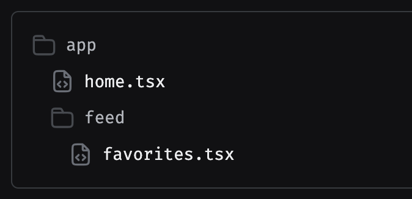

## Routing and Navigation

[Documentation Link](https://docs.expo.dev/tutorial/add-navigation/)

- Using **Expo Router**:
  - File-based routing
  - Nested routes
  - Dynamic routes (e.g., `[id].js`)
  - Types of Route Notation
    - Simple names/no notation
    - Square [brackets]
    - Group Routes - (Parentheses)
    - `index.tsx` files
    - `_layout.tsx` files
    - `+Plus` sign
  - Authentication
  - Nesting navigators
  - Modals
  - Shared routes
  - Protected routes
- OR using **React Navigation**:
  - Stack, tab, and drawer navigators
  - Navigation container setup

#### Simple names/no notation

- Regular file and directory names without any notation signify static routes. Their URL matches exactly as they appear in your file tree. So, a file named favorites.tsx inside the feed directory will have a URL of `/feed/favorites`.

#### Square [brackets]

- If you see square brackets in a file or directory name, you are looking at a dynamic route. The name of the route includes a parameter that can be used when rendering the page. The parameter could be either in a directory name or a file name. For example, a file named [userName].tsx will match `/evanbacon`, `/expo`, or another username. Then, you can access that parameter with the **`useLocalSearchParams`** hook inside the page, using that to load the data for that specific user.

#### Group Routes - (Parentheses)

- A directory with its name surrounded in parentheses indicates a route group. These directories are useful for grouping routes together without affecting the URL. For example, a file named app/(tabs)/settings.tsx will have `/settings` for its URL, even though it is not directly in the app directory.

- Route groups can be useful for simple organization purposes, but often become more important for defining complex relationships between routes.

#### index.tsx files

- Just like on the web, an index.tsx file indicates the default route for a directory. For example, a file named profile/index.tsx will match `/profile`. A file named (tabs)/index.tsx will match /, effectively becoming the default route for your entire app.

#### \_layout.tsx files

- \_layout.tsx files are special files that are not pages themselves but define how groups of routes inside a directory relate to each other. If a directory of routes is arranged as a stack or tabs, the layout route is where you would define that relationship by using a stack navigator or tab navigator component.

- Layout routes are rendered before the actual page routes inside their directory. This means that the \_layout.tsx directly inside the app directory is rendered before anything else in the app, and is where you would put the initialization code that may have previously gone inside an App.jsx file.

