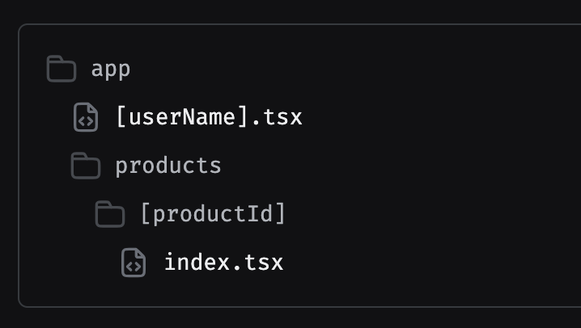

## Routing and Navigation

[Documentation Link](https://docs.expo.dev/tutorial/add-navigation/)

- Using **Expo Router**:
  - File-based routing
  - Nested routes
  - Dynamic routes (e.g., `[id].js`)
    - Catch all Segments
  - Types of Route Notation
    - Simple names/no notation
    - Square [brackets]
    - Group Routes - (Parentheses)
    - `index.tsx` files
    - `_layout.tsx` files
    - `+Plus` sign
  - Authentication
  - Nesting navigators
  - Modals
  - Shared routes
  - Protected routes
- OR using **React Navigation**:
  - Stack,
  - Tab
  - Drawer
  - Navigation container setup

## File-based routing

Expo Router is a routing framework for React Native and web applications. It allows you to manage navigation between screens in your app and use the same components on multiple platforms (Android, iOS and web). It uses a file-based method to determine routes inside your app. It also provides native navigation and is built on top of React Navigation.

**File-based routing conventions**

1. All routes must live inside the app folder
2. Any file that defaults exports a React component becomes a route
3. Each folder represents a segment of the URL path
4. Index files (index.js or index.tsx) represent the root of that segment

When these conventions are followed, the file automatically becomes available as
a route in your application
Files in the app folder that uniquely represent a route are called pages

```js
app/
  index.tsx         # URL: /
  about.tsx         # URL: /about
  profile/
    index.tsx       # URL: /profile
```

### **Navigating between routes**

#### Link

- Expo Router uses a built-in component called **`Link`** to move between routes in an app. This is conceptually similar to how web works with the `<a>` tag and the `href` attribute.

- You can use it by importing it from Expo Router library and then passing the `href` prop with the route to navigate as the value of the prop. For example, to navigate from `/` to `/details`, add a `Link` component in the index.tsx file:

```js
import { Link } from "expo-router";

<Link href="/details">View details</Link>;
```

#### Relative routes

- You don't always have to use the absolute path to a route. Using paths that start with `./` (for the current directory) or `../` (for the parent directory) will navigate relative to the current route.

- A relative URL is a URL prefix with `./`, such as `./article`, or `./article/`. Relative URLs are resolved relative to the current rendered screen.

```js
<Link href="./article">Go to article</Link>
```

```js
router.navigate("./article");
```

#### Passing query parameters

- Using dynamic route variables and query parameters in the destination page

```js
<Link href="/users?limit=20">View users</Link>

<Link
  href={{
    pathname: '/users',
    params: { limit: 20 }
  }}>
  View users
</Link>
```

**`useLocalSearchParams`**

```js
<Link href="/users?limit=20">View users</Link>
```

```js
import { useLocalSearchParams } from "expo-router";
import { View, Text } from "react-native";

export default function Users() {
  const { id, limit } = useLocalSearchParams();

  return (
    <View>
      <Text>User ID: {id}</Text>
      <Text>Limit: {limit}</Text>
    </View>
  );
}
```

**Updating query parameters without navigating**

```js
<Link href="/users?limit=50">View more users</Link>

<Pressable onPress={() => router.setParams({ limit: 50 })}>
  <Text>View more users</Text>
</Pressable>
```

#### Redirects

- You can immediately redirect to another route from a page or layout with the Redirect component. This functions like the replace imperative navigation function. A redirect will navigate to the new route without rendering the current page.

```js
import { Redirect } from "expo-router";

export default function Page() {
  return <Redirect href="/about" />;
}
```

#### Prefetching

#### Hooks

- `useNavigation()`
  - Provides navigation object to programmatically navigate between screens (e.g., **`navigation.navigate('ScreenName')`**).
- `useRouter()`
  - Returns the router object for advanced navigation control, such as **`router.push()`** or **`router.back()`**.
- `useLocalSearchParams()`
- `router.replace()`

#### Simple names/no notation

- Regular file and directory names without any notation signify static routes. Their URL matches exactly as they appear in your file tree. So, a file named favorites.tsx inside the feed directory will have a URL of `/feed/favorites`.

```js
app/
  home.tsx
  feed/
    favorites.tsx  # URL: /feed/favorites
```


#### Square [brackets] - Dynamic Routes

- If you see square brackets in a file or directory name, you are looking at a dynamic route. The name of the route includes a parameter that can be used when rendering the page. The parameter could be either in a directory name or a file name. For example, a file named [userName].tsx will match `/evanbacon`, `/expo`, or another username. Then, you can access that parameter with the **`useLocalSearchParams`** hook inside the page, using that to load the data for that specific user.

```js
app/
  [userName].tsx           # URL: /:userName (e.g., /evanbacon, /expo)
  products/
    [userName]/
      index.tsx          # URL: /products/:userName (e.g., /products/evanbacon)
```



#### Group Routes - (Parentheses)

- A directory with its name surrounded in parentheses indicates a route group. These directories are useful for grouping routes together without affecting the URL. For example, a file named app/(tabs)/settings.tsx will have `/settings` for its URL, even though it is not directly in the app directory.

- Route groups can be useful for simple organization purposes, but often become more important for defining complex relationships between routes.

```js
app/
  (tabs)/
    index.tsx      # URL: /
    settings.tsx   # URL: /settings
    profile.tsx    # URL: /profile
    dashboard.tsx  # URL: /dashboard
    about.tsx      # URL: /about
```


#### index.tsx files

- Just like on the web, an index.tsx file indicates the default route for a directory. For example, a file named profile/index.tsx will match `/profile`. A file named (tabs)/index.tsx will match /, effectively becoming the default route for your entire app.

```js
app/
  profile/
    index.tsx  # URL: /profile
  (tabs)/
    index.tsx  # URL: /
```


#### \_layout.tsx files

- \_layout.tsx files are special files that are not pages themselves but define how groups of routes inside a directory relate to each other. If a directory of routes is arranged as a stack or tabs, the layout route is where you would define that relationship by using a stack navigator or tab navigator component.

- Layout routes are rendered before the actual page routes inside their directory. This means that the \_layout.tsx directly inside the app directory is rendered before anything else in the app, and is where you would put the initialization code that may have previously gone inside an App.jsx file.

```js
app/
  _layout.tsx          # Defines navigation for the entire app directory
  (tabs)/
    _layout.tsx        # Defines navigation for the (tabs) group (e.g., tab navigator)
    index.tsx          # URL: /
    settings.tsx       # URL: /settings
    profile.tsx        # URL: /profile
    dashboard.tsx      # URL: /dashboard
    about.tsx          # URL: /about
  feed/
    _layout.tsx        # Defines navigation for the feed directory
```


