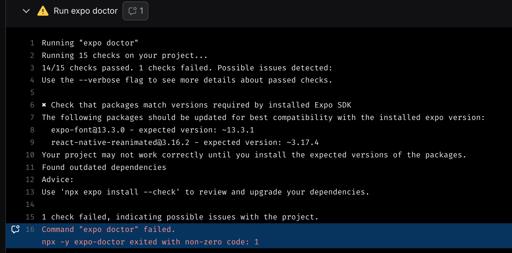

# ⚛️ REACT NATIVE Notes

---

### 📑 Table of Contents

#### 1. **What is React Native?**

- Overview of React Native
- Differences from traditional native development (iOS/Android)
- Advantages: cross-platform, fast refresh, native performance with JavaScript

---

#### 2. **Why React Native?**

- React Native vs Flutter
- React Native LTS (Long-Term Support) version benefits
  - Stability
  - Enterprise readiness
  - Expo SDK alignment

---

#### 3. **Setting Up the Environment**

- Install prerequisites:
  - Node.js, npm or yarn
- Install Expo CLI:
  ```bash
  npm install -g expo-cli
  ```
- Initialize a new Expo project:
  ```bash
  npx create-expo-app@latest
  cd MyApp
  npm start
  ```
- Use Expo Go app for live testing

---

#### 4. **Project File and Folder Structure**

- Default folder structure
- Recommended folders:
  - `components/`
  - `screens/`
  - `assets/`
  - `constants/`
  - `app/` (for Expo Router)
- Entry point: `App.js` or `app/index.js`

---

#### 5. **React Native Fundamentals / Core Components**

- UI Components:
  - `View`, `Text`, `Image`, `ScrollView`, `FlatList`, `TextInput`, `TouchableOpacity`, `SafeAreaView`, `KeyboardAvoidingView`
- Styling:
  - `StyleSheet.create()`
  - Inline styles vs external styles
- Layout with Flexbox:
  - `flexDirection`, `justifyContent`, `alignItems`
- Platform-specific styles using `Platform` API

---

#### 6. **Navigation**

- Using **Expo Router**:
  - File-based routing
  - Nested routes
  - Dynamic routes (e.g., `[id].js`)
- OR using **React Navigation**:
  - Stack, tab, and drawer navigators
  - Navigation container setup

---

#### 7. **State and Props**

- `useState` hook for managing state
- `useEffect` for side effects (e.g., API calls)
- Passing data via props
- Lifting state up between components

---

#### 8. **Fetching and Displaying Data**

- Using `fetch()` or Axios
- Showing lists with `FlatList` or `SectionList`
- Conditional rendering

---

#### 9. **Form Handling & User Inputs**

- Controlled components (`TextInput` with state)
- Form validation basics
- Handling button press events (`onPress`)

---

#### 10. **Assets and Media**

- Using images from the `assets/` folder
- Custom fonts with `expo-font`
- Audio/Video with `expo-av`

---

#### 11. **Debugging & Tools**

- Console logging
- Debugging with Chrome or React Native Debugger
- Using Flipper (native debugging)
- React DevTools

---

#### 12. **Building & Deployment**

- Preview with `npx expo start --preview`
- Development builds using [Expo Dev Builds](https://docs.expo.dev/develop/development-builds/introduction/)
- EAS Build for iOS and Android
- APK/IPA generation for testing

---

#### 13. **Next Steps & Going Beyond**

- Using TypeScript with React Native
- Integrating native modules (bare workflow)
- Performance optimization basics
- Writing reusable components
- Testing (Jest, React Native Testing Library)

---

Would you like this exported as a downloadable PDF or markdown file for easy reference?

## **Why React Native?**

- New **JSI** (Javascript Interface)
- TurboModules
- Fabric
- HotReloading


### 🔗 **JSI (JavaScript Interface)**

JSI is the bridge-less communication layer between JavaScript and native code. It's super fast and unlocks next-gen features like TurboModules and Fabric.

---

### ⚡ **TurboModules**

These are the upgraded version of native modules. They load on demand, which makes your app start faster and use memory more efficiently.

---

### 🧵 **Fabric**

Fabric is the new rendering engine. It's faster, more flexible, and supports better UI threading — so your app feels smoother and more responsive.

---

### 🔁 **HotReloading**

This is your dev-time BFF. It reloads only the changed files while preserving the app's state — which means faster debugging and less frustration.

---

## **React Native Fundamentals / Core Components**

[Core Components and APIs ⚠️](https://reactnative.dev/docs/components-and-apis)

- Button
- View
- Text
- TouchableOpacity
- TouchableHighlight
- TouchableWithoutFeedback
- ActivityIndicator (spinner)
- FlatList (Map long list)
- ScrollView
- SafeAreaView - `reactnative-safe-area-context`
- Image
- ImageBackground
- react-native-svg
- Modal
- Alert
- Switch
- StatusBar
- TextInput
- KeyboardAvoidingView
- Keyboard - `keyboard.dismiss()`
-

Styling

- Stylesheet
- NativeWind

Navigation

- Stack Navigation
- Tab Navigation

### `View`

- View is like div tag in react app
- View is flexbox layout by default
-

### `FlatList`

Question is

##### When should you use FlatList?

- For larger list and smooth scrolling

##### When should you use map?

- For small lists

## Project setup

Sure! Here's a clean title-only outline:

## [KeyboardAvoidingView](https://docs.expo.dev/guides/keyboard-handling/)

```javascript
<KeyboardAvoidingView behavior="padding" keyboardVerticalOffset={1} style={{ flex: 1 }}>
  Form
</KeyboardAvoidingView>
```

#### ✅ **What is `KeyboardAvoidingView`?**

- [Docs Link](https://docs.expo.dev/guides/keyboard-handling/)
- [Video Link](https://youtu.be/Y51mDfAhd4E)

`KeyboardAvoidingView` is a built-in React Native component that automatically adjusts the position of its children when the virtual keyboard appears. This ensures that inputs like `TextInput` are not hidden behind the keyboard.

---

#### 📘 **Syntax:**

```jsx
<KeyboardAvoidingView
  behavior="padding" // or "height", "position"
  keyboardVerticalOffset={Platform.OS === "ios" ? 64 : 0}
  style={{ flex: 1 }}>
  {/* content */}
</KeyboardAvoidingView>
```

---

#### 🛠️ **Props:**

| Prop                     | Description                                                                        |
| ------------------------ | ---------------------------------------------------------------------------------- |
| `behavior`               | Defines how the view should adjust. Options: `"height"`, `"position"`, `"padding"` |
| `keyboardVerticalOffset` | Extra space added when the keyboard appears. Useful to fine-tune layout shifts.    |
| `enabled`                | Boolean to toggle this behavior. Defaults to `true`.                               |
| `style`                  | Style for the wrapper view. Usually set to `flex: 1`.                              |

---

#### ⚙️ **`behavior` Options Explained:**

| `behavior`   | Description                                                                                 |
| ------------ | ------------------------------------------------------------------------------------------- |
| `"height"`   | Reduces the height of the view by the height of the keyboard. Best for full-screen layouts. |
| `"padding"`  | Adds padding to the bottom of the view. Often used on iOS.                                  |
| `"position"` | Moves the entire view upwards. Useful for small forms.                                      |

---

#### 🎯 **Use Cases:**

1. **Forms with multiple `TextInput`s**
   Prevents the keyboard from overlapping inputs.

   ```jsx
   <KeyboardAvoidingView behavior="padding" style={{ flex: 1 }}>
     <TextInput />
   </KeyboardAvoidingView>
   ```

2. **Login/Signup Screens**
   Keeps username and password fields visible when the keyboard is active.

3. **Chat Apps**
   Makes sure the message input at the bottom is still visible when typing.

4. **Notes / Comments Screens**
   Ideal for situations like your **NoteForm**, where the user types a lot.

---

#### 📝 **Tips:**

- Always wrap `KeyboardAvoidingView` in a `SafeAreaView` or `View` with `flex: 1`.
- Use `ScrollView` inside if you have multiple inputs and want scroll behavior.
- Adjust `keyboardVerticalOffset` to handle fixed headers or footers.

---

#### ❗ Gotchas:

- Doesn't work well on Android with `behavior="padding"` — prefer `"height"` or `"position"` there.
- On Android, sometimes you may need to also use `KeyboardAvoidingView` **with** `ScrollView` for best behavior.

---

Would you like a reusable version of a `KeyboardAwareWrapper` component with platform handling?

```javascript

```

---

📘 Project Setup Outline

1. Create and Start a New Project
2. Reset Project (Get a Fresh App Structure)
3. Install Required Packages
4. Initialize Tailwind Configuration
5. Create Global CSS File
6. Add Babel Preset
7. Customize Metro Config
8. Import Global CSS
9. Update `app.json`
10. Create `nativewind-env.d.ts` File

### [Create Project](https://docs.expo.dev/get-started/create-a-project/)

```javascript
npx create-expo-app@latest
```

- Start the app

```javascript
npx expo start
```

- If you get this error⚠️ then run code like this `something went wrong sorry about that. you can go back to expo home or try to reload the project`
- [Having problems](https://docs.expo.dev/get-started/start-developing/#having-problems)

```javascript
npx expo start --tunnel
```

- Use the `--clear` flag to clear the Metro bundler cache and resolve potential build or runtime issues:

```javascript
npx expo start --clear
```

- You can run project on **[android, Web, Expo](https://docs.expo.dev/linking/android-app-links/)**

#### Get a fresh project - Reset Project

When you're ready, run:

```bash
npm run reset-project
```

This command will move the starter code to the **app-example** directory and create a blank **app** directory where you can start developing.

### 1. Install packages

- `nativewind` - `tailwindcss` - `react-native-reanimated` - `react-native-safe-area-context`

- [Documentation Link](https://www.nativewind.dev/getting-started/installation)

- ⚠️ Always check the documentation for compatible versions

```javascript
npm install nativewind tailwindcss@^3.4.17 react-native-reanimated@3.16.2 react-native-safe-area-context
```

### 2. Setup Tailwind CSS

- Run **`npx tailwindcss init`** to create a **`tailwind.config.js`** file

- Add the paths to all of your component files in your tailwind.config.js file.

```javascript
/** @type {import('tailwindcss').Config} */
module.exports = {
  // NOTE: Update this to include the paths to all of your component files.
  content: ["./app/**/*.{js,jsx,ts,tsx}"],
  presets: [require("nativewind/preset")],
  theme: {
    extend: {},
  },
  plugins: [],
};
```

- Create a **`global.css`** file and in app folder and then add the Tailwind directives.

```javascript
@tailwind base;
@tailwind components;
@tailwind utilities;
```

### 3. Add the Babel preset

```javascript
module.exports = function (api) {
  api.cache(true);
  return {
    presets: [["babel-preset-expo", { jsxImportSource: "nativewind" }], "nativewind/babel"],
  };
};
```

### 4. Modify your metro.config.js

- Generate metro file with following commond

```javascript
npx expo customize metro.config.js
```

- Replace file with this code

```javascript
const { getDefaultConfig } = require("expo/metro-config");
const { withNativeWind } = require("nativewind/metro");

const config = getDefaultConfig(__dirname);

module.exports = withNativeWind(config, { input: "./global.css" });
```

### 5. Import your CSS file in **`index.js`** / root file in app

```javascript
import "./global.css";
```

### 6. Modify your app.json

- Switch the bundler to use the Metro bundler

```javascript
{
  "expo": {
    "web": {
      "bundler": "metro"
    }
  }
}
```

### 7. `nativewind-env.d.ts`

- If no `nativewind-env.d.ts` file then create it in root file and add the below code

```javascript
/// <reference types="nativewind/types" />

// NOTE: This file should not be edited and should be committed with your source code. It is generated by NativeWind.
```

## Routing and Navigation

[Documentation Link](https://docs.expo.dev/tutorial/add-navigation/)

- File-based routing
-

- Stack
- tabs
- Drawer
- Link
- `+not-found.tsx`

- [Types of route notation](https://docs.expo.dev/router/basics/notation/)

  - Simple names/no notation
  - Square [brackets]
  - Group Routes - (Parentheses)
  - index.tsx files
  - \_layout.tsx files
  - +Plus sign

- Authentication
- Nesting navigators
- Modals
- Shared routes
- Protected routes

#### Simple names/no notation

- Regular file and directory names without any notation signify static routes. Their URL matches exactly as they appear in your file tree. So, a file named favorites.tsx inside the feed directory will have a URL of `/feed/favorites`.


#### Square [brackets]

- If you see square brackets in a file or directory name, you are looking at a dynamic route. The name of the route includes a parameter that can be used when rendering the page. The parameter could be either in a directory name or a file name. For example, a file named [userName].tsx will match `/evanbacon`, `/expo`, or another username. Then, you can access that parameter with the **`useLocalSearchParams`** hook inside the page, using that to load the data for that specific user.


#### Group Routes - (Parentheses)

- A directory with its name surrounded in parentheses indicates a route group. These directories are useful for grouping routes together without affecting the URL. For example, a file named app/(tabs)/settings.tsx will have `/settings` for its URL, even though it is not directly in the app directory.

- Route groups can be useful for simple organization purposes, but often become more important for defining complex relationships between routes.


#### index.tsx files

- Just like on the web, an index.tsx file indicates the default route for a directory. For example, a file named profile/index.tsx will match `/profile`. A file named (tabs)/index.tsx will match /, effectively becoming the default route for your entire app.


#### \_layout.tsx files

- \_layout.tsx files are special files that are not pages themselves but define how groups of routes inside a directory relate to each other. If a directory of routes is arranged as a stack or tabs, the layout route is where you would define that relationship by using a stack navigator or tab navigator component.

- Layout routes are rendered before the actual page routes inside their directory. This means that the \_layout.tsx directly inside the app directory is rendered before anything else in the app, and is where you would put the initialization code that may have previously gone inside an App.jsx file.


#### +Plus sign

- Routes starting with a + have special significance to Expo Router, and are used for specific purposes. One example is +not-found, which catches any requests that don't match a route in your app. +html is used to customize the HTML boilerplate used by your app on web. +native-intent is used to handle deep links into your app that don't match a specific route, such as links generated by third party services.


## [Create a development build](https://docs.expo.dev/develop/development-builds/create-a-build/)

#### 1. Install expo-dev-client

```javascript
npx expo install expo-dev-client
```

#### 2. Build the native app (Android)

```javascript
eas build --platform android --profile development
```

#### 3. Build the native app (iOS Simulator)

- Add a `development` Profile to `eas.json`
- If you want to use a `development` profile, add it like this:

```javascript
{
  "cli": {
    "appVersionSource": "remote"
  },
  "build": {
    "development": {
      "developmentClient": true,
      "distribution": "internal"
    },
    "preview": {
      "android": {
        "buildType": "apk"
      }
    },
    "preview2": {
      "android": {
        "gradleCommand": ":app:assembleRelease"
      }
    },
    "preview3": {
      "developmentClient": true
    },
    "preview4": {
      "distribution": "internal"
    },
    "production": {}
  }
}
```

Now you can run:

```javascript
eas build --platform android --profile development
```

### Warning: ⚠️

- Due to runing above code you may face some issues like **`your app is not runing in Expo Go`**, it is using **`development build`**.

### Solution⚡️:

- ✅ Reset Your Metro Cache

```javascript
npx expo start --clear
```

- ✅ Make Sure You Don't Have a dev-client Installed

```javascript
npm uninstall expo-dev-client
# or
yarn remove expo-dev-client
```

- ✅ Avoid Using --dev-client Flag

```javascript
npx expo start --dev-client ❌
```

Update eas.json file back to this

```javascript
{
  "cli": {
    "appVersionSource": "remote"
  },
  "build": {
    "preview": {
      "android": {
        "buildType": "apk"
      }
    },
    "preview2": {
      "android": {
        "gradleCommand": ":app:assembleRelease"
      }
    },
    "preview3": {
      "developmentClient": true
    },
    "preview4": {
      "distribution": "internal"
    },
    "production": {}
  }
}
```

## Build APK

- 🔗 [Build APKs for Android Emulators and devices](https://docs.expo.dev/build-reference/apk/)
-

#### 1. Create **`eas.json`** file in root folder

```javascript
{
  "cli": {
    "appVersionSource": "remote"
  },
  "build": {
    "preview": {
      "android": {
        "buildType": "apk"
      }
    },
    "preview2": {
      "android": {
        "gradleCommand": ":app:assembleRelease"
      }
    },
    "preview3": {
      "developmentClient": true
    },
    "preview4": {
      "distribution": "internal"
    },
    "production": {}
  }
}
```

#### 2. Create Account on Expo

- Run following commond

```javascript
eas build -p android --profile preview
```

- Login with the username and password

- If you get `⚠️ zsh: command not found: eas`. ✅ Install `eas-cli` Globally

- [EAS Docs](https://expo.dev/eas)

```javascript
npm install -g eas-cli
```

- Check Version

```javascript
eas --version
```

- Then re-run your build command:

```javascript
eas build -p android --profile preview
```

- ⚠️ keystore Error

```javascript
⚠️ Detected that you do not have keytool installed locally.
✖ Generating keystore in the cloud...
Request failed: 500 (Internal Server Error)
Error: build command failed. ⚠️
```

- ✅ Option 1: Install keytool locally
- keytool comes with the Java JDK, so:

- Install JDK (Java Development Kit) if not already installed:

```javascript
brew install --cask temurin
```

- Then check:

```javascript
keytool - version;
```

- ✅ Option 2: Manually generate a keystore and upload to EAS
  If the cloud generation keeps failing, you can manually create a keystore:

```javascript
keytool -genkey -v -keystore my-release-key.keystore -alias my-key-alias -keyalg RSA -keysize 2048 -validity 10000
```

Then provide it to EAS via:

```javascript
eas credentials
```

- ⚠️ `gradlew Error` ⚠️
  
  Warnings  
   

- Fix Issues With following things

- Try to update your npm packages

```javascript
npm update
```

- Run this command to let Expo automatically identify what's incompatible:

```javascript
 npx expo install --check
```

- Run again build commond

```javascript
eas build -p android --profile preview
```

Copy and paste url in browser to download the app.

- Build details: https://expo.dev/accounts/ahsaniqbal480/projects/fitx-fitness-gym-app/builds/3df1ae83-91c1-4aca-8f8b-8bd8ae5bccc5

- 🤖 Android app:
  https://expo.dev/artifacts/eas/8DDCEgPi7TdrutAEhN4JLe.apk

## Storage options React Native

In a React Native (Expo) project, you have several options for **data storage**, depending on the use case (e.g., local vs. cloud, key-value vs. structured, encrypted vs. plaintext). Here's a breakdown:

---

### 🔸 Storage options Table

| Use Case               | Recommended Option       |
| ---------------------- | ------------------------ |
| Key-value (non-secure) | `AsyncStorage`           |
| Key-value (secure)     | `SecureStore`            |
| Structured data        | `SQLite`                 |
| High-performance       | `MMKV` (needs EAS)       |
| File storage           | `expo-file-system`       |
| Cloud sync             | Firebase, Supabase, etc. |

---

## Expo Storage options

1. AsyncStorage
2. Expo FileSystem
3. Expo SecureStore
4. SQLite (Expo)
5. MMKV (via `react-native-mmkv`)
6. Cloud Storage Options

- Firebase
- Supabase
- Appwrite
- Realm
-

7. WatermelonDB

### 🔹 1. **AsyncStorage**

#### ✅ Best for:

- Storing simple key-value data locally (tokens, preferences)
- `AsyncStorage` is an asynchronous, unencrypted, key-value storage system that allows you to persist data locally in your React Native app.

#### 🔧 Setup:

If using Expo SDK 50+:

- With npm:

```bash
npm install @react-native-async-storage/async-storage
```

- With Yarn:

```bash
yarn add @react-native-async-storage/async-storage
```

- With Expo CLI:

```bash
npx expo install @react-native-async-storage/async-storage
```

```js
import AsyncStorage from "@react-native-async-storage/async-storage";

await AsyncStorage.setItem("token", "abc123");
const token = await AsyncStorage.getItem("token");
await AsyncStorage.removeItem("token");
```

- **Pros**: Simple, widely used
- **Cons**: Not encrypted

### 🔹 Commonly Used Functions

#### ✅ `setItem(key, value)`

Stores a string value with the given key.

```js
await AsyncStorage.setItem("userToken", "abc123");
```

#### ✅ `getItem(key)`

Retrieves the string value for the key.

```js
const token = await AsyncStorage.getItem("userToken");
```

#### ✅ `removeItem(key)`

Removes the specified key.

```js
await AsyncStorage.removeItem("userToken");
```

#### ✅ `clear()`

Clears **all keys** stored in AsyncStorage.

```js
await AsyncStorage.clear();
```

#### ✅ `multiSet([[key, value], ...])`

Sets multiple key-value pairs at once.

```js
await AsyncStorage.multiSet([
  ["theme", "dark"],
  ["language", "en"],
]);
```

#### ✅ `multiGet([key1, key2, ...])`

Gets multiple keys at once.

```js
const values = await AsyncStorage.multiGet(["theme", "language"]);
values.forEach(([key, value]) => console.log(key, value));
```

#### ✅ `getAllKeys()`

Lists all keys currently stored.

```js
const keys = await AsyncStorage.getAllKeys();
```

---

### 🔹 Example Use Cases

#### ✅ Store a login token

```js
await AsyncStorage.setItem("token", "xyz123");
```

#### ✅ Get token for authentication

```js
const token = await AsyncStorage.getItem("token");
if (token) {
  // proceed with authenticated flow
}
```

---

### 🔹 Custom Hook: `useAsyncStorage`

This hook simplifies storing and retrieving a value.

```tsx
import { useState, useEffect } from "react";
import AsyncStorage from "@react-native-async-storage/async-storage";

export function useAsyncStorage(key) {
  const [storedValue, setStoredValue] = useState(null);
  const [loading, setLoading] = useState(true);

  useEffect(() => {
    const load = async () => {
      try {
        const item = await AsyncStorage.getItem(key);
        if (item !== null) {
          setStoredValue(JSON.parse(item));
        }
      } catch (error) {
        console.error("Failed to load AsyncStorage key:", key, error);
      } finally {
        setLoading(false);
      }
    };
    load();
  }, [key]);

  const setValue = async (value) => {
    try {
      await AsyncStorage.setItem(key, JSON.stringify(value));
      setStoredValue(value);
    } catch (error) {
      console.error("Failed to set AsyncStorage key:", key, error);
    }
  };

  const removeValue = async () => {
    try {
      await AsyncStorage.removeItem(key);
      setStoredValue(null);
    } catch (error) {
      console.error("Failed to remove AsyncStorage key:", key, error);
    }
  };

  return { storedValue, setValue, removeValue, loading };
}
```

---

#### ✅ Example Usage

```tsx
const { storedValue: user, setValue: setUser, removeValue: logout } = useAsyncStorage("user");

useEffect(() => {
  if (user) {
    console.log("User loaded:", user);
  }
}, [user]);

// To save user:
setUser({ name: "John", role: "admin" });

// To log out:
logout();
```

---

### ✅ Custom Hook: `useAsyncStorageList`

```tsx
import AsyncStorage from "@react-native-async-storage/async-storage";
import { useEffect, useState } from "react";

type UseAsyncStorageListOptions<T> = {
  storageKey: string;
  initialData?: T[];
};

export function useAsyncStorageList<T>({
  storageKey,
  initialData = [],
}: UseAsyncStorageListOptions<T>) {
  const [items, setItems] = useState<T[]>([]);
  const [loading, setLoading] = useState(true);

  useEffect(() => {
    loadItems();
  }, []);

  const loadItems = async () => {
    try {
      const storedData = await AsyncStorage.getItem(storageKey);
      if (storedData) {
        setItems(JSON.parse(storedData));
      } else {
        setItems(initialData);
      }
    } catch (error) {
      console.error(`Error loading data for key "${storageKey}":`, error);
    } finally {
      setLoading(false);
    }
  };

  const saveItems = async (newItems: T[]) => {
    try {
      await AsyncStorage.setItem(storageKey, JSON.stringify(newItems));
      setItems(newItems);
    } catch (error) {
      console.error(`Error saving data for key "${storageKey}":`, error);
    }
  };

  const addItem = async (item: T) => {
    const newList = [item, ...items];
    await saveItems(newList);
  };

  const updateItem = async (id: string, updatedFields: Partial<T>) => {
    const newList = items.map((item: any) =>
      item.id === id ? { ...item, ...updatedFields } : item
    );
    await saveItems(newList);
  };

  const removeItem = async (id: string) => {
    const newList = items.filter((item: any) => item.id !== id);
    await saveItems(newList);
  };

  return {
    items,
    loading,
    setItems: saveItems,
    addItem,
    updateItem,
    removeItem,
    reload: loadItems,
  };
}
```

---

### ✅ Usage Example: Notes App

```tsx
const {
  items: notes,
  addItem: createNote,
  updateItem: editNote,
  removeItem: deleteNote,
  reload: loadNotes,
} = useAsyncStorageList<NoteType>({
  storageKey: "@notes_app_storage",
});
```

#### Where `NoteType` is:

```ts
type NoteType = {
  id: string;
  title: string;
  content: string;
  createdAt: string;
  updatedAt: string;
};
```

---

### ✅ Adding a New Note Example

```tsx
createNote({
  id: `${Date.now()}_${Math.random().toString(36).substr(2, 9)}`,
  title: "New Note",
  content: "This is the content",
  createdAt: new Date().toISOString(),
  updatedAt: new Date().toISOString(),
});
```

---

### 🔹 2. **SecureStore (Expo)**

#### ✅ Best for:

- Storing sensitive data (tokens, passwords)

#### 🔧 Setup:

```bash
npx expo install expo-secure-store
```

```js
import * as SecureStore from "expo-secure-store";

await SecureStore.setItemAsync("token", "abc123");
const token = await SecureStore.getItemAsync("token");
await SecureStore.deleteItemAsync("token");
```

- **Pros**: Encrypted, secure
- **Cons**: Slower, limited data size

---

### 🔹 3. **SQLite (Expo)**

#### ✅ Best for:

- Structured data, offline storage

#### 🔧 Setup:

```bash
npx expo install expo-sqlite
```

```js
import * as SQLite from "expo-sqlite";

const db = SQLite.openDatabase("mydb.db");
db.transaction((tx) => {
  tx.executeSql(
    "CREATE TABLE IF NOT EXISTS items (id INTEGER PRIMARY KEY AUTOINCREMENT, value TEXT);"
  );
  tx.executeSql("INSERT INTO items (value) VALUES (?);", ["test"]);
});
```

- **Pros**: Good for relational data
- **Cons**: More complex than key-value storage

---

### 🔹 4. **MMKV (via `react-native-mmkv`)**

#### ✅ Best for:

- High-performance local storage

#### ⚠️ Not supported by Expo Go (needs EAS Build or dev client)

```bash
npm install react-native-mmkv
```

- **Pros**: Very fast, encrypted
- **Cons**: Not Expo Go-compatible without custom dev client

---

### 🔹 5. **FileSystem (Expo)**

#### ✅ Best for:

- Storing files, images, or blobs

#### 🔧 Setup:

```bash
npx expo install expo-file-system
```

```js
import * as FileSystem from "expo-file-system";

const fileUri = FileSystem.documentDirectory + "myfile.txt";
await FileSystem.writeAsStringAsync(fileUri, "Hello World");
const contents = await FileSystem.readAsStringAsync(fileUri);
```

- **Pros**: Flexible for files
- **Cons**: Not ideal for structured data

---

### 🔹 6. **Cloud Storage Options**

- **Firebase** (Firestore, Realtime DB, Cloud Storage)
- **Supabase**
- **AWS Amplify**
- Use these for syncing data across devices and users.
