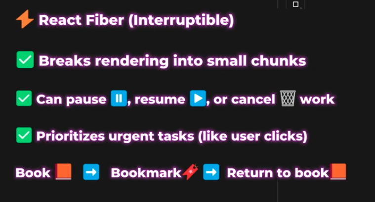

## React Native Interview Questions & Answers

## Table of Questions

0. Current React Native Version
1. What is React Native, and how is it different from React?
2. What are the core components of React Native?
3. Explain the concept of JSX in React Native.
4. What is the significance of the 'render' method in React Native components?
5. How does the React Native bridge work?
6. What is the difference between `View`, `ScrollView`, and `FlatList`?
7. What is the use of `StyleSheet.create()`?
8. How do you handle platform-specific code?
9. Difference between `useState`, `useEffect`, and `useRef`?
10. How to share state across multiple screens?
11. What is Context API?
12. Handling async data loading in components?
13. How does `React Navigation` work?
14. Difference between stack, tab, and drawer navigation?
15. Passing and retrieving params?
16. Guarded/authenticated route?
17. What is Redux?
18. Actions, reducers, and store?
19. Using Redux Toolkit?
20. Middleware in Redux?
21. Consuming REST APIs?
22. Storing tokens securely?
23. Login/logout?
24. AsyncStorage usage?
25. Optimizing FlatList?
26. Memoization techniques?
27. Common performance issues?
28. Debugging tools?
29. What is an SDK?
30. How to expose component as npm package?
31. Version and publish library?
32. Bridging native module?
33. Used Native Modules?
34. What is bridge?
35. Integrate native code?
36. Steps for native module?
37. Handle async events?
38. Why use TypeScript?
39. Typing props and state?
40. Interface vs type?
41. Debugging RN apps?
42. What is Flipper?
43. Writing unit tests?
44. Testing tools?
45. Controlled vs uncontrolled components?
46. Deep linking?
47. What is CodePush?
48. Push notifications?
49. App permissions?
50. Difference b/w Native & Hybrid App
51.

### 🔹 **Basic React Native Questions**

### 0. Current React Native Version

- React Native 0.80.1
- React 19.1.0
- Node 22.16.0
- NPM 11.4.2

### 1. What is React Native, and how is it different from React?

- **Answer**: React Native is a framework for building mobile applications using JavaScript and React. React Native is a JavaScript framework for building cross-platform apps. Unlike React (for web), React Native uses native components (e.g., `<View>` instead of `<div>`).

- **Example**: A `LoginScreen` component in React Native uses `<TextInput>` instead of `<input>` for text fields.

### 2. What are the core components of React Native?

**[Core Components and APIs ⚠️](https://reactnative.dev/docs/components-and-apis)**

- Button
- View
- Text
- ScrollView
- SafeAreaView - `reactnative-safe-area-context`
- Image
- TouchableOpacity
- TextInput
- TouchableHighlight
- TouchableWithoutFeedback
- ActivityIndicator (spinner)
- FlatList (Map long list)
- ImageBackground
- react-native-svg
- Modal
- Alert
- Switch
- StatusBar
- KeyboardAvoidingView
- Keyboard - `keyboard.dismiss()`

  ```jsx
  <View>
    <Text>Hello World</Text>
  </View>
  ```

### 3. What is `StyleSheet.create()`?

- `StyleSheet.create()` is a method in React Native that helps define styles in a structured and optimized way. It creates a stylesheet object whose values are immutable and cached, improving performance.

**Example:**

```jsx
import { StyleSheet, View, Text } from "react-native";

const styles = StyleSheet.create({
  container: {
    padding: 16,
    backgroundColor: "#f2f2f2",
  },
  text: {
    color: "#333",
    fontSize: 18,
  },
});

export default function App() {
  return (
    <View style={styles.container}>
      <Text style={styles.text}>Styled with StyleSheet.create()</Text>
    </View>
  );
}
```

### 4. Explain the concept of JSX in React Native.

- JSX is a **syntax extension** in React Native that allows embedding HTML-like elements within JavaScript code.

### 5. What is the significance of the 'render' method in React Native components?

- The 'render' method in a React Native component is responsible for returning the JSX representation of the component's UI. It defines what the component should render on the screen based on its current state and props. React Native automatically updates the UI when the state or props change, re-invoking the 'render' method to reflect those changes visually.

### 6. How would you style a React Native component?

- React Native components can be styled using the `StyleSheet`, which allows you to define styles in a JavaScript object, similar to CSS but with camelCase property names.

**Example:**

```jsx
import { StyleSheet, View, Text } from "react-native";

const styles = StyleSheet.create({
  container: {
    backgroundColor: "#e0e0e0",
    padding: 20,
    borderRadius: 8,
  },
  text: {
    color: "#222",
    fontSize: 16,
    fontWeight: "bold",
  },
});

export default function MyComponent() {
  return (
    <View style={styles.container}>
      <Text style={styles.text}>Styled with StyleSheet</Text>
    </View>
  );
}
```

### 7. What is the use of `StyleSheet.create()`?

- **Answer**: It optimizes performance by creating a stylesheet object with immutable styles.
- **Example**:

  ```jsx
  const styles = StyleSheet.create({
    container: { padding: 10 },
  });
  ```

### 8. What is the difference between `View`, `ScrollView`, and `FlatList`?

- **Answer**:

  - `View`: Basic container.
  - `ScrollView`: Scrollable container (good for small lists).
  - `FlatList`: Optimized for rendering large lists.

- **Example**: Use `FlatList` for chat messages to handle performance.

### 9. How does the React Native bridge work?

- **Answer**: React Native uses a bridge to communicate between JS and native code (Java/Kotlin or Swift/Obj-C). Messages are serialized and sent over the bridge asynchronously.
- **Example**: Calling a native camera module from JavaScript.

The React Native framework provides a set of JavaScript bindings to native iOS and Android APIs. Using these bindings, we're able to control the user interface and access device hardware, like the camera.

**Example: Calling a native camera module from JavaScript**

```js
import { NativeModules } from "react-native";

const { CameraModule } = NativeModules;

// Call a native method to open the camera
CameraModule.openCamera((result) => {
  console.log("Camera result:", result);
});
```

### 10. How do you handle platform-specific code?

- **Answer**: Use `Platform.OS`, file extensions (`.ios.js`, `.android.js`), or conditional logic.
- **Example**:

  ```jsx
  Platform.OS === "ios" ? doIOSFunction() : doAndroidFunction();
  ```

### 11. Define Prop

- 'Props' (short for properties) are a way to pass data from a parent component to a child component in React Native. They allow components to be dynamic and reusable by providing different data and behavior based on where they are used. Props are read-only and help maintain a unidirectional data flow.

```js
- Prop Types
- Children Props
- Default Props
```

### 11.1. React Reconciliation vs React Fiber — To-the-point Difference:

- **React Reconciliation** is the process by which React updates the DOM to match the virtual DOM. It decides what has changed and applies minimal DOM operations.

  - Reconciliation is **Stack** based render. ❌Coudn't pause once rendering started. When React is working to updates UI, it had to ⏳finish all at once.
    

- **React Fiber (Interruptible)** is the new reconciliation engine(new brain) introduced in React 16. It is the architecture behind how React schedules and prioritizes updates.
  
  

### Key Differences:

| Feature                     | React Reconciliation (Pre-Fiber) | React Fiber                                                          |
| --------------------------- | -------------------------------- | -------------------------------------------------------------------- |
| **Update Model**            | Recursive and synchronous        | Incremental and asynchronous                                         |
| **Interruptible Rendering** | No                               | Yes — can pause, resume, abort                                       |
| **Prioritization**          | No built-in prioritization       | Supports prioritizing updates (e.g., animations vs background tasks) |
| **Architecture**            | Stack-based                      | Fiber tree — reimplementation of the stack using linked list nodes   |
| **Error Handling**          | Poor support                     | Introduced error boundaries                                          |

In short: **Reconciliation is the process; Fiber is the architecture** that makes that process more efficient and flexible.

### 12. What is State?

- State is a built-in React object that is used to contain data or information about the component.

### 13. Is useState synchronous or asynchronous?

- Asynchronous

```js
const [count, setCount] = useState(0);

setCount(count + 20);
setCount((count) => count + 20);

console.log(count);
```

### 14. What are the types of setState in useState?

```js
const [count, setCount] = useState(0);
```

- Two types
  - constant
  - function

### 15. What is the difference between `useState`, `useEffect`, and `useRef`?

- `useState`: Stores local component state.
- `useEffect`: Runs side effects.
- `useRef`: Holds mutable values.

- **Example**:

  ```jsx
  const [count, setCount] = useState(0);
  useEffect(() => console.log(count), [count]);
  const inputRef = useRef(null);
  ```

### 15.1 What is the difference between `useState` and `useRef`?

| Feature            | `useState`                               | `useRef`                                     |
| ------------------ | ---------------------------------------- | -------------------------------------------- |
| Purpose            | Manages **reactive state**               | Holds a **mutable reference** (non-reactive) |
| Triggers Re-render | ✅ Yes — updates cause re-render         | ❌ No — changes do **not** trigger re-render |
| Common Use Cases   | UI state (e.g. input value, count)       | Storing DOM refs, timers, previous values    |
| Persistence        | Value persists between renders           | Also persists between renders                |
| Usage Example      | `const [count, setCount] = useState(0);` | `const inputRef = useRef(null);`             |
| Real Use Case      | Tracking user input and updating UI      | Focusing input field or storing timeout ID   |

### 16. What is mutable and immutable?

- **Mutable:** Mutable objects are those whose state can be changed after creation.
- **Immutable:** Immutable objects are those whose state cannot be changed after creation.

### 17. What are Hooks? (One liner answer)

- Hooks are functions that allow you to use React state and lifecycle features in functional components. They enable you to reuse stateful logic without changing your component hierarchy.

- They provide a more concise and flexible way to manage complexity compared to traditional lifecycle methods in class components.

### 18. What are Pure Components?

- Pure components are also stateless components. When you pass the same props, they will return the same output/results. React has **`React.PureComponent`**.
- This actually increases performance of the app.

### 19. What is a Higher Order Component (HOC)?

- Higher order components are actually functions. You pass a component as input and it returns another component as output.

### 20. What are Controlled & Uncontrolled Components?

[Detail Video]()

- **Controlled components** are form elements whose values are controlled by React using state. Like input fields.

- **Uncontrolled component** is like traditional HTML form inputs that you will not be able to handle the value by yourself but the DOM will take care of handling the value of the input and save it then you can get this value using **`React Ref`** and for example, print it inside alert when submitting or play with this value as you want.

```javascript
import React, { useRef } from "react";

export default function App() {
  const inputRef = useRef(null);
  const handleSubmitButton = () => {
    alert(inputRef.current.value);
  };
  return (
    <div className="App">
      <input type="text" ref={inputRef} />
      <input type="submit" value="submit" onClick={handleSubmitButton} />
    </div>
  );
}
```

### 21. What are Stateful components and Stateless components?

- **Stateful Component**: A component that is managing state and has capacity to rerender.

- **Stateless Component**: Stateless components, by contrast, have no state. They are handled by props.

- [Detail Video](https://www.youtube.com/shorts/AWmm1gHBJic?feature=share)

### 22. What is Prop Drilling & Prop Uplifting?

### 23. What is 'state' in React Native and how is it different from 'props'?

| Aspect         | Props                                                               | State                                                             |
| -------------- | ------------------------------------------------------------------- | ----------------------------------------------------------------- |
| Definition     | Data passed from parent to child component                          | Data managed internally within the component                      |
| Mutability     | Immutable (read-only)                                               | Mutable (can be changed using `setState`)                         |
| Usage          | Used to configure or customize child components                     | Used for dynamic data that changes over time within the component |
| Update Trigger | Changing props does **not** trigger re-render in the child directly | Updating state triggers a re-render of the component              |
| Control        | Controlled by parent component                                      | Controlled by the component itself                                |

### 24. How do you handle user input using React Native?

- User input in React Native is managed using event handlers such as `onChangeText` for text fields and `onPress` for buttons. State is typically used to store and update the input value.

**Example:**

```jsx
import React, { useState } from "react";
import { View, TextInput, Button, Text, Alert } from "react-native";

export default function InputExample() {
  const [name, setName] = useState("");

  const handlePress = () => {
    Alert.alert("Hello", `Hello, ${name}!`);
  };

  return (
    <View style={{ padding: 16 }}>
      <Text>Enter your name:</Text>
      <TextInput
        value={name}
        onChangeText={setName}
        placeholder="Type here"
        style={{
          borderWidth: 1,
          borderColor: "#ccc",
          padding: 8,
          marginVertical: 8,
        }}
      />
      <Button title="Say Hello" onPress={handlePress} />
    </View>
  );
}
```

### 24.1. How does React determine when to re-render a component ?

- React re-render when props or states change, with shallow comparison.

How to optimize the unnecessary renders?


### Explain React's batching behaviour and what changed in React 18?

**Definition:**  
Batching in React refers to the process where multiple state updates are grouped together and applied in a single render cycle, improving performance by reducing unnecessary re-renders.

**What changed in React 18?**  
Before React 18, batching only occurred inside React event handlers. In React 18, batching is extended to more scenarios, such as timeouts, native event handlers, and asynchronous operations (like promises), leading to more efficient updates.

**Example:**

```jsx
import React, { useState } from "react";

export default function BatchingExample() {
  const [count, setCount] = useState(0);
  const [flag, setFlag] = useState(false);

  const handleClick = () => {
    setTimeout(() => {
      setCount((c) => c + 1);
      setFlag((f) => !f);
      // In React 18+, both updates are batched and cause a single re-render
    }, 1000);
  };

  return (
    <div>
      <p>Count: {count}</p>
      <p>Flag: {flag.toString()}</p>
      <button onClick={handleClick}>Update</button>
    </div>
  );
}
```

_In React 18+, both `setCount` and `setFlag` inside the `setTimeout` are batched, resulting in a single re-render. In previous versions, each would trigger a separate render._


### 25. What is a Lifecycle Method?

- Every component in React goes through a lifecycle of events. I like to think of them as going through a cycle of birth, growth, and death.

**Mounting** – Birth of your component  
**Update** – Growth of your component  
**Unmount** – Death of your component

### 26. How do you handle navigation between screens in React Native?

Navigation between screens in React Native is typically handled using libraries such as React Navigation. You set up a navigator (e.g., Stack, Tab, or Drawer Navigator) and register your screens as components. To move between screens, you use navigation methods like `navigate`, `push`, and `goBack` provided by the navigation prop.

**Example:**

```jsx
// Navigating to a screen named "Profile"
navigation.navigate("Profile");

// Going back to the previous screen
navigation.goBack();
```

### 27. What is the concept of 'flexbox' and its role in React Native layout?

- **Flexbox** is a layout model that helps arrange and align components within a container, making it easier to create responsive layouts. In React Native, flexbox is the default layout system, allowing you to control the direction, alignment, and distribution of space among items in a container.

**Example:**

```jsx
import React from "react";
import { View, Text, StyleSheet } from "react-native";

export default function FlexboxExample() {
  return (
    <View style={styles.container}>
      <Text style={styles.box}>Box 1</Text>
      <Text style={styles.box}>Box 2</Text>
      <Text style={styles.box}>Box 3</Text>
    </View>
  );
}

const styles = StyleSheet.create({
  container: {
    flex: 1,
    flexDirection: "row", // Arrange children in a row
    justifyContent: "space-between", // Distribute space between children
    alignItems: "center", // Align children vertically in the center
    padding: 16,
  },
  box: {
    backgroundColor: "#4CAF50",
    color: "#fff",
    padding: 16,
    borderRadius: 4,
  },
});
```

- In this example, the three boxes are arranged in a row, spaced evenly, and centered vertically using flexbox properties.

### 28. What are 'keys' in React Native and why are they important in lists?

- 'Keys' are special attributes used by React Native to **uniquely identify elements** in a list. They help React Native optimize re-rendering when the list changes, improving performance and **preventing rendering glitches**.

### 29. How can you make a network request in React Native?

- In React Native, you can make network requests using the built-in **`fetch`** API or libraries like **`Axios`**. These requests are asynchronous and can be handled with promises or **`async/await`**.

### 30. What is the purpose of 'AsyncStorage' in React Native?

- 'AsyncStorage' is an API in React Native for **asynchronous, unencrypted, and persistent storage** of small amounts of data. It's often used to store settings, preferences, or authentication tokens locally on the user's device.

### 31. What are the available options for Storage in React Native?

#### Storage Options Table

| Storage Option     | Type         | Security  | Platform Support | Use Case Examples                |
| ------------------ | ------------ | --------- | ---------------- | -------------------------------- |
| AsyncStorage       | Key-Value    | Basic     | iOS, Android     | User preferences, tokens         |
| SecureStore (Expo) | Key-Value    | Encrypted | iOS, Android     | Sensitive data, auth tokens      |
| SQLite (Expo)      | SQL Database | Moderate  | iOS, Android     | Structured data, offline caching |
| MMKV               | Key-Value    | Encrypted | iOS, Android     | Fast storage, large data sets    |
| FileSystem (Expo)  | Files        | Depends   | iOS, Android     | Images, documents, backups       |
| Cloud Storage      | Remote       | High      | All              | Backups, syncing across devices  |

#### Expo Storage Options

- **AsyncStorage**

  - Commonly Used Functions:
    - `setItem`, `getItem`, `removeItem`, `mergeItem`, `clear`
  - Example Use Cases:
    - Storing user settings, authentication tokens, app state
  - Custom Hook: `useAsyncStorage`
  - Custom Hook: `useAsyncStorageList`
  - Usage Example: Notes App

    ```jsx
    import AsyncStorage from "@react-native-async-storage/async-storage";

    // Save a note
    await AsyncStorage.setItem("note", "This is a note");

    // Retrieve a note
    const note = await AsyncStorage.getItem("note");
    ```

- **SecureStore (Expo)**

  - For storing sensitive data securely (e.g., passwords, tokens)
  - Example:
    ```js
    import * as SecureStore from "expo-secure-store";
    await SecureStore.setItemAsync("token", "abc123");
    ```

- **SQLite (Expo)**

  - For structured, relational data storage
  - Example:
    ```js
    import * as SQLite from "expo-sqlite";
    const db = SQLite.openDatabase("notes.db");
    ```

- **MMKV** (via `react-native-mmkv`)

  - High-performance, encrypted key-value storage
  - Example:
    ```js
    import { MMKV } from "react-native-mmkv";
    const storage = new MMKV();
    storage.set("user", "John");
    ```

- **FileSystem (Expo)**

  - For storing files, images, and documents
  - Example:
    ```js
    import * as FileSystem from "expo-file-system";
    await FileSystem.writeAsStringAsync(FileSystem.documentDirectory + "file.txt", "Hello");
    ```

- **Cloud Storage Options**
  - Firebase, AWS S3, Google Cloud Storage, etc.
  - Used for syncing data across devices or backups

### 32. How can you integrate Redux with a React Native app?

- To integrate Redux in a React Native app:
  1. Install `redux` and `react-redux`.
  2. Create a Redux store using reducers.
  3. Wrap your app with the `<Provider>` component from `react-redux` and pass the store.
  4. Use `useSelector` to access state and `useDispatch` to dispatch actions in your components.

### 33. How do you optimize performance in a React Native application?

- Optimize performance in React Native by:

  1. Using `React.PureComponent` or `React.memo` to prevent unnecessary re-renders.
  2. Memoizing functions and values with `useCallback` and `useMemo`.
  3. Optimizing render methods and minimizing the number of components rendered.
  4. Implementing code splitting and lazy loading where possible.
  5. Using FlatList or SectionList for large lists instead of ScrollView.
  6. Profiling with tools like `React DevTools` and `Flipper` to identify bottlenecks.

  ### 33.1 Differences b/w useMemo() and useCallback() in React. When to use them?

  - **useMemo** stores/caches the result of a computation (the return value of a function).

    - **When to use it:** When you want to memoize expensive calculations or derived data, such as filtering or sorting a large list, so the computation only runs when dependencies change.

    ```js
    const filteredList = useMemo(() => {
      return items.filter((item) => item.active);
    }, [items]);
    ```

  - **useCallback** stores/caches the function itself, returning the same function instance unless dependencies change.

    - **When to use it:** When you want to prevent unnecessary re-creations of functions, especially when passing callbacks to child components that rely on reference equality (e.g., in dependency arrays or React.memo).

    ```js
    const handleClick = useCallback(() => {
      setCount((c) => c + 1);
    }, []);
    ```

  **Summary Table:**

| Hook            | Purpose                                | Returns        | Used For                       |
| --------------- | -------------------------------------- | -------------- | ------------------------------ |
| `useMemo()`     | Caches the **result** of a computation | A **value**    | Expensive calculations         |
| `useCallback()` | Caches the **function itself**         | A **function** | Prevents re-creating functions |

---

### 34. What are 'Touchable' components in React Native and how do they work?

- 'Touchable' components in React Native, such as `TouchableOpacity` and `TouchableHighlight`, provide touch interactions for UI elements. They respond to touch events like `onPress` and `onLongPress`, and provide visual feedback, making apps feel more interactive.

### 35. How do you handle form validation in React Native?

Form validation in React Native is typically managed **`using component state and event handlers.`** You capture user input with components like `TextInput`, validate the input according to your rules (e.g., required fields, email format), and display error messages as needed. For more complex forms, libraries like **[Formik](https://formik.org/)** and **[Yup](https://github.com/jquense/yup)** can simplify validation logic.

**Example (basic validation):**

```jsx
import React, { useState } from "react";
import { View, TextInput, Button, Text } from "react-native";

export default function FormExample() {
  const [email, setEmail] = useState("");
  const [error, setError] = useState("");

  const validate = () => {
    if (!email.includes("@")) {
      setError("Invalid email address");
    } else {
      setError("");
      // Proceed with form submission
    }
  };

  return (
    <View>
      <TextInput
        value={email}
        onChangeText={setEmail}
        placeholder="Enter email"
        style={{ borderWidth: 1, marginBottom: 8 }}
      />
      {error ? <Text style={{ color: "red" }}>{error}</Text> : null}
      <Button title="Submit" onPress={validate} />
    </View>
  );
}
```

**Tip:** For advanced validation, consider using Formik with Yup for schema-based validation.

### 36. React Native Managed vs Bare

-

### 37. Explain the Virtual DOM and its relevance in React Native.

- The Virtual DOM is a concept in React (and React Native) that represents the UI as an in-memory tree structure of components. When there are changes to a component's props or state, React generates a new Virtual DOM tree, compares it with the previous one using a process called **`reconciliation`**, and then updates the actual DOM with the minimal necessary changes.

### 38. What is the purpose of the 'PixelRatio' module in React Native?

-

### 39. **How do you handle push notifications in a React Native app?**

Push notifications are essential for keeping users engaged with an app. To handle push notifications in a React Native app, follow these steps:

**1. Set up push notification services**  
Integrate a push notification service like **Firebase Cloud Messaging (FCM)** or **Apple Push Notification Service (APNs)** for iOS.

**2. Request permissions**  
Use libraries such as **`react-native-push-notification`** or **`@react-native-community/push-notification-ios`** to request notification permissions from users.

**3. Handle registration**  
Register the device token with the push notification service. The token is necessary for sending notifications to the device.

**4. Handle notifications**  
Configure the app to handle incoming notifications, whether the app is in the foreground, background, or closed. You can define custom behaviors based on notification data.

**5. Display notifications**  
Use the notification library to display local or remote notifications to users.

**Example (using Firebase Cloud Messaging):**

```js
import messaging from "@react-native-firebase/messaging";
import { Alert } from "react-native";

// Request permission
await messaging().requestPermission();

// Get device token
const token = await messaging().getToken();

// Listen for foreground messages
messaging().onMessage(async (remoteMessage) => {
  Alert.alert("New Notification", remoteMessage.notification.body);
});
```

### **40. How can you implement bi-directional communication in React Native?**

Bi-directional communication involves the exchange of data and events between parent and child components. React Native provides several ways to achieve this:

- **Props:** Pass data from parent to child components using props. Child components receive data as props and can trigger events by using callbacks passed from the parent.
- **Context API:** Use the Context API to share data between components that are not directly connected in the component tree. This avoids the need to pass props through intermediate components.
- **State management libraries:** Libraries like Redux and MobX enable global state management, allowing any component to access and modify shared state.
- **Events and callbacks:** Child components can emit events or call callbacks provided by the parent components to communicate changes or trigger actions.
- **React hooks:** Use custom hooks to encapsulate stateful logic and share it across components, enabling reusable behavior.
- **Native modules (for native communication):** For complex scenarios, you can create native modules that expose native functionality to JavaScript and vice versa.

The choice of communication method depends on the complexity of your app and the level of decoupling you need between components.

### 41. Discuss the role of 'SafeAreaView' in React Native and why it's important.

- SafeAreaView is a component provided by React Native that ensures content is displayed within safe insets, avoiding overlaps with notches, status bars, and navigation bars on various devices. It's particularly important for creating a consistent and user-friendly UI across different screen

### 42. Explain the purpose of the 'AppState' module in React Native.

### 43. Describe the bridge communication in React Native.

**Bridge communication in React Native** refers to the mechanism that enables JavaScript code to communicate with native code on the device.

#### Key Points

- **Asynchronous communication:** The bridge handles asynchronous communication between JavaScript and native modules. JavaScript sends requests to native modules, which are executed on the native thread, and results are sent back to JavaScript.
- **Native modules:** Native modules are JavaScript modules that expose methods to be called from JavaScript. These modules are implemented in native code (Java/Objective-C/Swift) and provide access to native functionality.
- **Performance:** The bridge allows React Native to achieve native performance by delegating heavy computations and UI rendering to the native side.
- **Serialization and deserialization:** Data sent between JavaScript and native code is serialized and deserialized (often as JSON), ensuring compatibility between the two environments.
- **Communication overhead:** Frequent communication between JavaScript and native code can introduce overhead. It's important to optimize communication patterns for performance.

### 44. How can you implement background tasks in a React Native app?

Background tasks are important for performing operations that don't require user interaction when the app is not in the foreground. React Native provides mechanisms to achieve background tasks:

#### Common Approaches for Background Tasks in React Native

- **Headless JS:** Run JavaScript code in the background, even when the app is closed. Useful for tasks like data sync, analytics, and notification processing.
- **Background fetch:** Use the `react-native-background-fetch` library to schedule periodic background data updates or trigger actions.
- **Push notifications:** While not true background tasks, push notifications can prompt the app to perform actions or updates when received.
- **Native modules:** For advanced background processing, implement custom native modules to handle tasks on the native side.
- **Background geolocation:** Use the `react-native-background-geolocation` library to track device location and perform actions based on location changes, even in the background.

**Example (using react-native-background-fetch):**

```js
import BackgroundFetch from "react-native-background-fetch";

BackgroundFetch.configure(
  {
    minimumFetchInterval: 15, // minutes
  },
  async (taskId) => {
    // Perform your background task here
    console.log("Background fetch executed");
    BackgroundFetch.finish(taskId);
  },
  (error) => {
    console.log("Background fetch failed to start", error);
  }
);
```

> **Note:** iOS background execution is limited and subject to system constraints. Always test thoroughly on real devices.

### 45. Explain the concept of 'Babel' and its role in React Native development.

- Babel is a JavaScript compiler that converts modern JavaScript code (ES6/ES7) into an older version (ES5) that is compatible with most browsers and environments. In React Native development, Babel allows developers to write modern JavaScript syntax in their codebase, which is then transformed into code that the React Native runtime can understand. This enables the use of features like arrow functions, classes, and destructuring. Babel is crucial for ensuring cross-platform compatibility and leveraging the latest language features while maintaining broader device support.

### 46. Explain the purpose of 'FlatList' and 'SectionList' for efficient data rendering.

'FlatList' and 'SectionList' are React Native components designed for efficiently rendering large lists of data.

- **FlatList** is used for simple, single-column lists.
- **SectionList** is used for grouped lists with section headers.

Both use "virtualization," meaning only items visible on the screen are rendered, which greatly improves performance and reduces memory usage for long lists.

They support features like lazy loading, pull-to-refresh, and customizable rendering via props such as `renderItem` (for items) and `renderSectionHeader` (for section headers).

**Example: FlatList**

```jsx
import React from "react";
import { FlatList, Text, View } from "react-native";

const data = [
  { id: "1", name: "Apple" },
  { id: "2", name: "Banana" },
  { id: "3", name: "Cherry" },
];

export default function MyList() {
  return (
    <FlatList
      data={data}
      keyExtractor={(item) => item.id}
      renderItem={({ item }) => (
        <View style={{ padding: 10 }}>
          <Text>{item.name}</Text>
        </View>
      )}
    />
  );
}
```

**Example: SectionList**

```jsx
import React from "react";
import { SectionList, Text, View } from "react-native";

const sections = [
  {
    title: "Fruits",
    data: ["Apple", "Banana", "Cherry"],
  },
  {
    title: "Vegetables",
    data: ["Carrot", "Broccoli"],
  },
];

export default function MySectionList() {
  return (
    <SectionList
      sections={sections}
      keyExtractor={(item, index) => item + index}
      renderItem={({ item }) => (
        <View style={{ padding: 10 }}>
          <Text>{item}</Text>
        </View>
      )}
      renderSectionHeader={({ section: { title } }) => (
        <Text style={{ fontWeight: "bold", fontSize: 16 }}>{title}</Text>
      )}
    />
  );
}
```

Great question! Let's break down how `React.Suspense` works and go beyond the common lazy loading use case.

---

### ✅ **46.1 How does `React.Suspense` work, and what are some real use cases beyond lazy loading?**

---

### 🔹 **What is `Suspense`?**

`React.Suspense` is a component that lets you **“wait” for something before rendering**. It shows a fallback UI (like a loading spinner) while the content is not yet ready.

---

### ✅ **Basic Syntax (for lazy loading components):**

```jsx
const LazyComponent = React.lazy(() => import("./MyComponent"));

<Suspense fallback={<Text>Loading...</Text>}>
  <LazyComponent />
</Suspense>;
```

---

### 🔹 **How It Works Internally**

- When a component throws a **promise** (e.g., during data fetching or dynamic import), React pauses rendering and shows the `fallback`.
- Once the promise resolves, rendering continues.

---

### ✅ **Use Cases Beyond Lazy Loading**

#### **1. Data Fetching with Suspense (e.g., with Relay or React Query experimental)**

React 18 supports **concurrent rendering** and **data-fetching Suspense**, where data can also suspend the component.

Example using a custom data loader:

```js
const resource = fetchData(); // this returns an object with a `.read()` method

function Profile() {
  const user = resource.user.read(); // this suspends until user data is ready
  return <Text>{user.name}</Text>;
}
```

Then wrap with Suspense:

```jsx
<Suspense fallback={<Text>Loading profile...</Text>}>
  <Profile />
</Suspense>
```

---

#### **2. Image Loading Suspense**

You can wrap ``-like logic to suspend until the image is loaded:

```js
const imgResource = loadImage("https://example.com/pic.jpg");

function ImageComponent() {
  imgResource.read(); // suspends until image is loaded
  return <Image source={{ uri: "https://example.com/pic.jpg" }} />;
}
```

---

#### **3. Skeleton Screens for Complex UI**

Use `Suspense` to show partial UIs while some parts (like a chart, list, or graph) are loading asynchronously.

```jsx
<Suspense fallback={<SkeletonChart />}>
  <DashboardChart />
</Suspense>
```

---

### ✅ Summary: When to Use Suspense

| Use Case               | Example                          |
| ---------------------- | -------------------------------- |
| Lazy component loading | `React.lazy()`                   |
| Data fetching          | React Query, Relay, custom cache |
| Image / asset loading  | Custom suspending resource       |
| Concurrent UI parts    | Show skeletons for slower parts  |

---

Certainly! Here's the **completed and optimized answer** for your interview prep:

---

### ✅ **46.2 How do you optimize large lists in React?**

Suppose you have **100,000+ items** to render — rendering them all at once would crash the app or significantly hurt performance.

---

### 🔹 **Solution: Virtualization**

**Virtualization** is a technique where only the **visible items in the viewport** are rendered, and the rest are skipped until needed. This improves **memory usage** and **scroll performance**.

---

### ✅ **React Native: Use `FlatList`**

`FlatList` in React Native is **already virtualized** by default.

```jsx
<FlatList
  data={bigDataArray}
  renderItem={({ item }) => <Text>{item.title}</Text>}
  keyExtractor={(item) => item.id.toString()}
  initialNumToRender={10}
  maxToRenderPerBatch={20}
  windowSize={5}
/>
```

---

### 🔧 **Important Props to Optimize:**

| Prop                    | Description                                            |
| ----------------------- | ------------------------------------------------------ |
| `initialNumToRender`    | How many items to render initially                     |
| `maxToRenderPerBatch`   | Max items rendered in each batch                       |
| `windowSize`            | Number of viewports (screens) worth of items to render |
| `getItemLayout`         | Improves scroll performance by avoiding measurement    |
| `removeClippedSubviews` | Unmounts offscreen items (default: true)               |

---

### ✅ **Web: Use `react-window` or `react-virtualized`**

Example with `react-window`:

```jsx
import { FixedSizeList as List } from "react-window";

<List height={500} itemCount={100000} itemSize={35} width={300}>
  {({ index, style }) => <div style={style}>Row {index}</div>}
</List>;
```

---

### ✅ **Real-Time Use Case**

> In a React Native finance app, rendering all transaction history for a power user (e.g. 100,000 records) would be heavy. Using `FlatList` with `getItemLayout` and pagination ensures smooth scrolling without freezing the app.

---

### 47. Different Hooks name

React Hooks

- useState
- useEffect
- useRef
- useReducer
- useLayoutEffect
- useMemo
- useCallback
- useId
- useImpertiveHandle
- useContext
- useTransition

### 48. Custom Hooks

Some of the most useful and commonly used custom hooks in React Native:

- `useIsMobile`
- `useNotes`
- `useGetProducts`
- `useKeyboard` – Detects keyboard open/close and height.
- `useDarkMode` – Detects and responds to system dark mode.
- `useDimensions` – Gets device/window dimensions for responsive layouts.
- `usePrevious` – Tracks the previous value of a variable.
- `useFetch` – Handles data fetching with loading and error states.
- `useDebounce` – Debounces a value for delayed updates (e.g., search input).
- `useAsyncStorage` – Simplifies AsyncStorage usage with state.
- `useIsMounted` – Checks if a component is still mounted before updating state.
- `useTimeout` – Runs a callback after a delay.

### 49. How page performance increase in React?

Performance optimization techniques explain.

- Code Splitting
- Lazy Loading
- Memoization
- Use Production Build
- Reduce Bundle Size
- Optimize Images and Assets:
- Minimize Renders:
- Optimize State Management:

### State management in React

- Context API
- Redux & Redux Tool Kit (RTK)
- Mobx
- Zustand

### 50. If I write await then how program will execute?

- When i put await in any function. This specific part become synchronous.

### 51. Interceptors in Axios

- Jab bhe request ay gi ya jay gi to ya, interceptor say guzar kr process ho gi. It is like middleware.

- Interceptors allow you to modify the request or response before it is sent or received by the server.

- Interceptors are useful because they allow developers to add custom functionality to requests and responses without modifying the actual code that makes the request.

### 51. How does React Hanlde Hydration in SSR, what problems can arise?

Hydration is the process where React attaches event listeners and reuses the static HTML that was sent from the server — instead of rebuilding the entire DOM.

> 💡 SSR (Server-Side Rendering) sends a pre-rendered HTML to the browser, and React hydrates it by attaching interactivity.

- [Video Link](https://youtu.be/R-BKadZWYnQ?list=TLPQMDYwNzIwMjWo1LQdc9C71w)

Benefits of Hydration:

- Improved User Experience:
- Better SEO:
- Seamless Transitions:

**✅ How Hydration Works**

| Step                                                                       | Description |
| -------------------------------------------------------------------------- | ----------- |
| 1. Server renders the page using `ReactDOMServer.renderToString()`         |             |
| 2. HTML is sent to the browser (fast first paint)                          |             |
| 3. Browser loads React JS bundle                                           |             |
| 4. React runs `ReactDOM.hydrate()` to bind events and enable interactivity |             |

**Hydration Code**

```js
// Server-side (e.g. Next.js or Express)
const html = ReactDOMServer.renderToString(<App />);

// Client-side
ReactDOM.hydrate(<App />, document.getElementById("root"));
```

### Client-Side Rendering (CSR) || Server-Side Rendering (SSR) || Hydration in React

---

## ✅ **1. Client-Side Rendering (CSR)**

### 🔹 What is CSR?

- CSR means the **entire HTML is generated in the browser using JavaScript**.
- On initial load, the browser receives a mostly empty HTML file and loads React to render everything.
- Good for **highly interactive apps** but **slower time-to-first-paint**.

---

### ✅ Example (React CSR via CRA or Vite)

```html
<!-- index.html -->
<body>
  <div id="root"></div>
  <script src="bundle.js"></script>
</body>
```

```jsx
// index.js
import React from "react";
import ReactDOM from "react-dom/client";
import App from "./App";

const root = ReactDOM.createRoot(document.getElementById("root"));
root.render(<App />);
```

🟢 React renders the UI **fully in the browser** after the JavaScript loads.

---

## ✅ **2. Server-Side Rendering (SSR)**

### 🔹 What is SSR?

- SSR means the HTML is **generated on the server** using `ReactDOMServer`.
- The browser receives a **fully-rendered HTML page**, improving first paint speed.
- Useful for SEO and performance.

---

### ✅ Example (Basic Express + React SSR)

```js
// server.js
import express from "express";
import ReactDOMServer from "react-dom/server";
import App from "./App";

const app = express();

app.get("*", (req, res) => {
  const html = ReactDOMServer.renderToString(<App />);
  res.send(`
    <!DOCTYPE html>
    <html>
      <head><title>SSR</title></head>
      <body>
        <div id="root">${html}</div>
        <script src="/bundle.js"></script>
      </body>
    </html>
  `);
});

app.listen(3000);
```

🟢 User receives **rendered HTML**; React still needs to hydrate for interactivity.

---

## ✅ **3. Hydration in React**

### 🔹 What is Hydration?

- After SSR sends HTML, **hydration attaches React’s event handlers** to the static markup.
- This is done using `ReactDOM.hydrate()` instead of `render()`.

---

### ✅ Example

```jsx
// client.js
import React from "react";
import ReactDOM from "react-dom";
import App from "./App";

ReactDOM.hydrate(<App />, document.getElementById("root"));
```

🟢 This tells React: “The DOM already exists, just connect the events and logic to it.”

---

## 🔄 **Comparison Summary**

| Feature     | Client-Side Rendering     | Server-Side Rendering   | Hydration                      |
| ----------- | ------------------------- | ----------------------- | ------------------------------ |
| Render Time | In browser after JS loads | HTML rendered on server | Binds React to server HTML     |
| First Paint | Slower                    | Faster                  | Same as SSR + attaches events  |
| SEO         | Poor                      | Great                   | Great (SSR-powered)            |
| Use Case    | SPAs, dashboards          | Blogs, landing pages    | Required for SSR interactivity |

---

### 🔹 **Hooks & State Management**

8. **How to share state across multiple screens?**

   - **Answer**: Use Context API or Redux.
   - **Example**: Store user authentication status in Context.

9. **What is Context API?**

   - **Answer**: Allows passing data globally without props.
   - **Example**: Theme context for dark/light mode.

10. **Handling async data loading in components?**

    - **Answer**: Use `useEffect` with async function inside.
    - **Example**:

      ```jsx
      useEffect(() => {
        (async () => {
          const data = await fetchData();
          setData(data);
        })();
      }, []);
      ```

---

### 🔹 **Navigation**

11. **How does `React Navigation` work?**

    - **Answer**: It manages screen transitions and navigation stack.

12. **Difference between stack, tab, and drawer navigation?**

    - Stack: Push/pop screens (e.g., `Login > Home > Details`).
    - Tab: Bottom tabs (e.g., Instagram-style tabs).
    - Drawer: Side menu (e.g., Gmail).

13. **Passing and retrieving params?**

    - **Answer**:

      ```jsx
      navigation.navigate("Profile", { userId: 123 });
      const { userId } = route.params;
      ```

14. **Guarded/authenticated route?**

    - **Answer**: Use conditional rendering based on auth state.

---

### 🔹 **Redux / State Management**

15. **What is Redux?**

    - **Answer**: A global state management library.

16. **Actions, reducers, and store?**

    - Actions describe what happened.
    - Reducers define how state changes.
    - Store holds the global state.

17. **Using Redux Toolkit?**

    - **Answer**: Simplifies Redux setup.
    - **Example**:

      ```js
      const counterSlice = createSlice({
        name: "counter",
        initialState: 0,
        reducers: { increment: (state) => state + 1 },
      });
      ```

18. **Middleware in Redux?**

    - **Answer**: Handles side effects like API calls (e.g., Redux Thunk).

---

### 🔹 **APIs & Authentication**

19. **Consuming REST APIs?**

    - **Example**:

      ```js
      const response = await axios.get("/users");
      ```

20. **Storing tokens securely?**

    - Use `@react-native-async-storage/async-storage` or `react-native-keychain`.

21. **Login/logout?**

    - On login: store token.
    - On logout: remove token and redirect.

22. **AsyncStorage usage?**

    ```js
    await AsyncStorage.setItem("token", "abc123");
    ```

---

### 🔹 **Performance Optimization**

23. **Optimizing FlatList?**

    - Use `initialNumToRender`, `getItemLayout`, `keyExtractor`.

24. **Memoization techniques?**

    - `React.memo`, `useCallback`, `useMemo`.

25. **Common performance issues?**

    - Unnecessary re-renders, large images, deep nested views.

26. **Debugging tools?**

    - Flipper, React DevTools, Chrome Debugger.

---

### 🔹 **SDKs & Reusable Components**

27. **What is an SDK?**

    - A software kit to integrate functionality in other apps.

28. **How to expose component as npm package?**

    - Bundle and publish it using `npm publish`.

29. **Version and publish library?**

    - Update `package.json` version and push to npm.

30. **Bridging native module?**

    - Android: Java class implements `ReactContextBaseJavaModule`.
    - iOS: Use `@objc` bridge and `RCTBridgeModule`.

31. **Used Native Modules?**

    - Example: Custom module to check battery level or open camera.

---

### 🔹 **Native Modules & Bridging**

32. **What is bridge?**

    - A communication channel between JS and native code.

33. **Integrate native code?**

    - Create Java/Swift module and expose methods.

34. **Steps for native module?**

    - Define native function > expose to RN > link module > call from JS.

35. **Handle async events?**

    - Use Promises or callbacks in native code.

---

### 🔹 **TypeScript in React Native**

36. **Why use TypeScript?**

    - Adds type safety and better code documentation.

37. **Typing props and state?**

    ```ts
    interface Props {
      title: string;
    }
    const MyComponent: React.FC<Props> = ({ title }) => <Text>{title}</Text>;
    ```

38. **Interface vs type?**

    - `interface` is better for objects; `type` for unions.

---

### 🔹 **Testing & Debugging**

39. **Debugging RN apps?**

    - Use `console.log`, Flipper, Chrome debugger.

40. **What is Flipper?**

    - A dev tool to inspect layout, network, and logs.

41. **Writing unit tests?**

    - Use `Jest` and `React Native Testing Library`.

42. **Testing tools?**

    - Jest, Detox, Enzyme, Testing Library.

---

### 🔹 **Miscellaneous**

43. **Controlled vs uncontrolled components?**

    - Controlled: State managed by React.
    - Uncontrolled: Uses ref.

44. **Deep linking?**

    - Enables app to be opened with a URL scheme.

45. **What is CodePush?**

    - OTA updates for RN apps without app store deploys.

46. **Push notifications?**

    - Use services like Firebase Cloud Messaging (FCM).

47. **App permissions?**

    - Use `PermissionsAndroid` or `react-native-permissions`.

---
